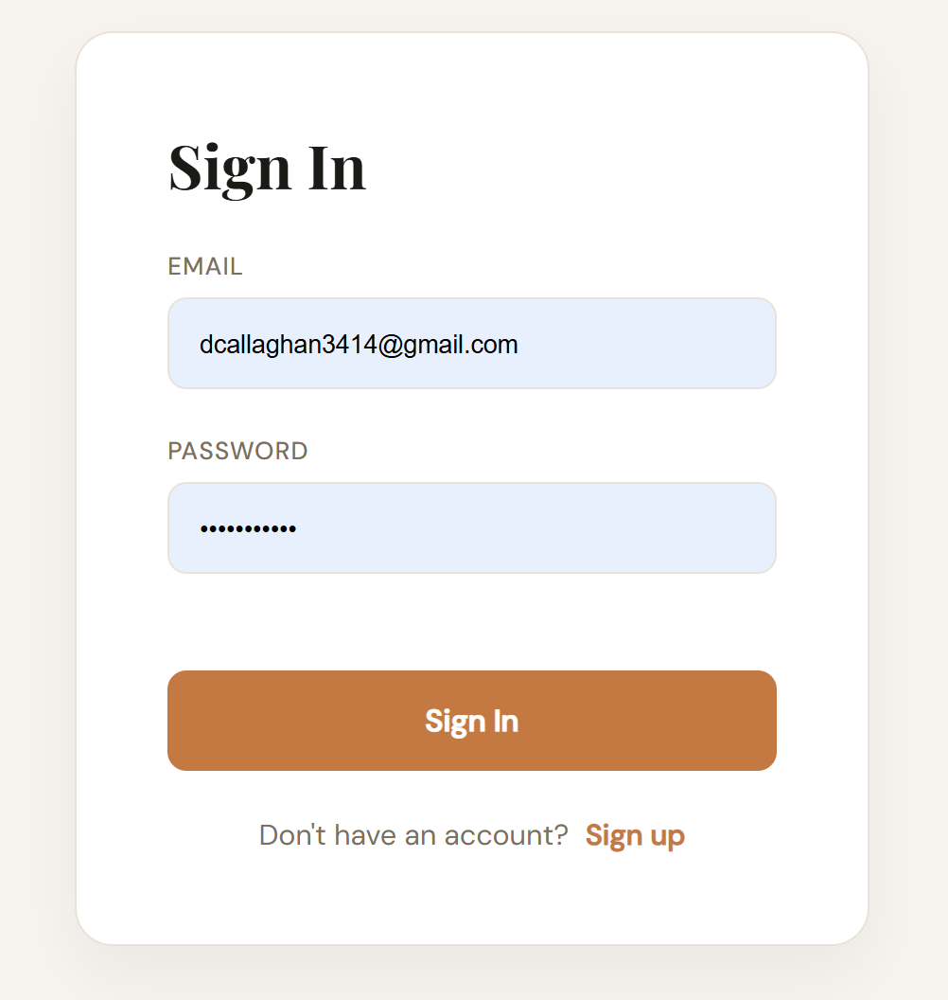
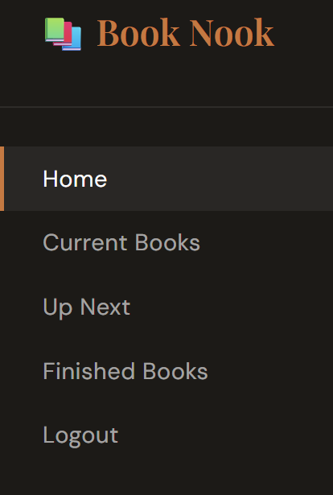
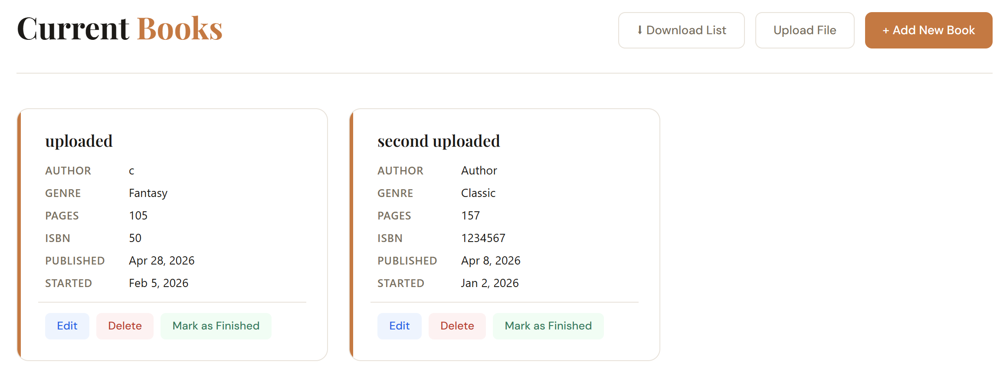
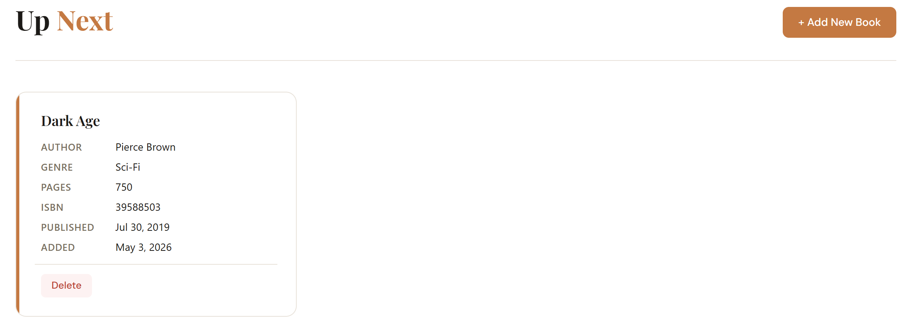
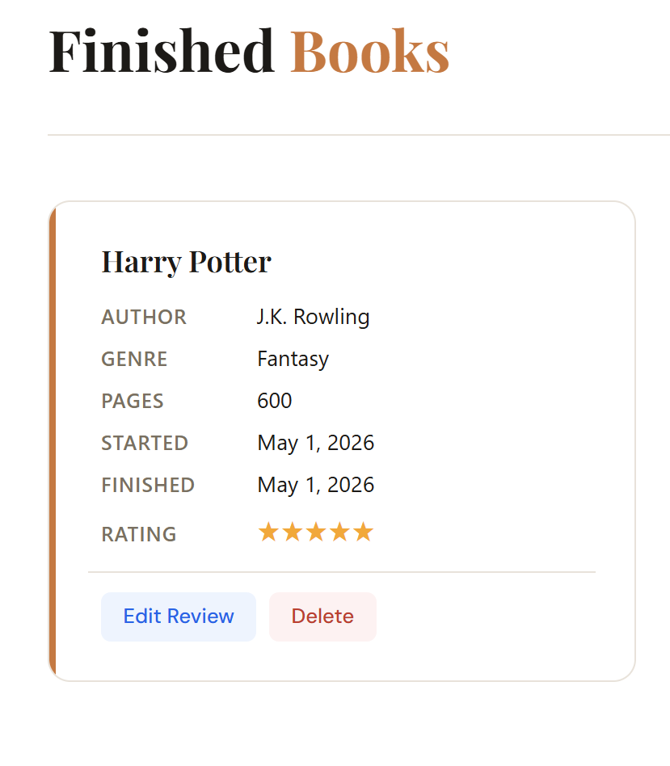

# CS3980 Final Project (Reading Tracker)

We developed a comprehensive and user-friendly book tracking application that allows users to organize book lists, track their reading progress, write reviews, obtain statistics on reading habits, and set reading goals.

___

<strong> Steps for running app: </strong>

**1.** Create virtual environment (run this the first time you pull the code because the virtual environment isn't pushed to GitHub):

```bash
python -m venv venv
```
**2.** Activate the virtual environment:
```bash
.\venv\Scripts\activate
```
or
```bash
.\venv\Scripts\Activate.ps1
```
**3.** Install the necessary dependencies:
```bash
pip install -r requirements.txt
```

**4.** Run app after activating virtual environment by running in the terminal:
```bash
uvicorn main:app --reload
```
The API should run locally at `http://127.0.0.1:8000`.

___

## App Features:

**Sign in page:**<br>


**Sidebar of Pages:**<br>


**Current books page and features:**<br>


**Up next page:**<br>


**Finished Books page:**<br>


**MongoDB:**<br>


___

## Sources

Dashboard styling source: https://www.youtube.com/watch?v=NnniXasJIpY and ClaudeAI

Photo on main page: Photo by <a href="https://unsplash.com/@borodinanadi?utm_source=unsplash&utm_medium=referral&utm_content=creditCopyText">nadi borodina</a> on <a href="https://unsplash.com/photos/white-and-pink-flowers-on-white-printer-paper-xkx93Q2Pe8E?utm_source=unsplash&utm_medium=referral&utm_content=creditCopyText">Unsplash</a>
      
